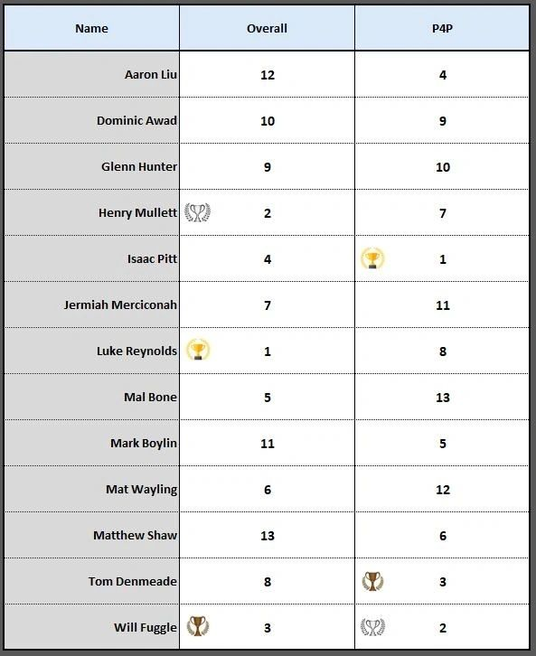
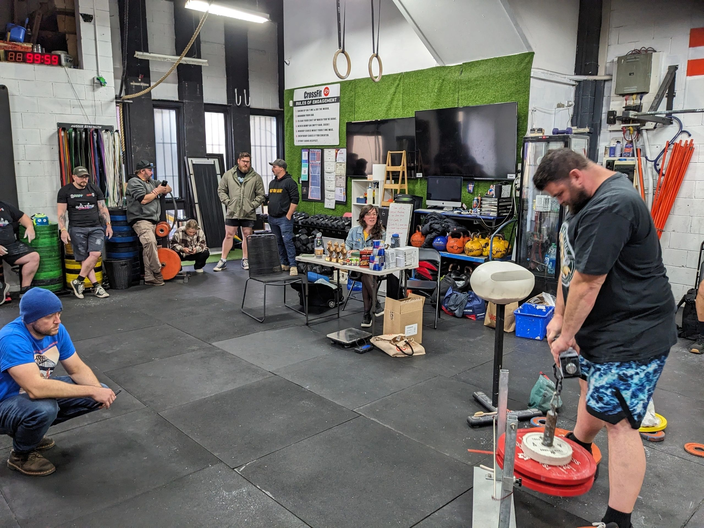
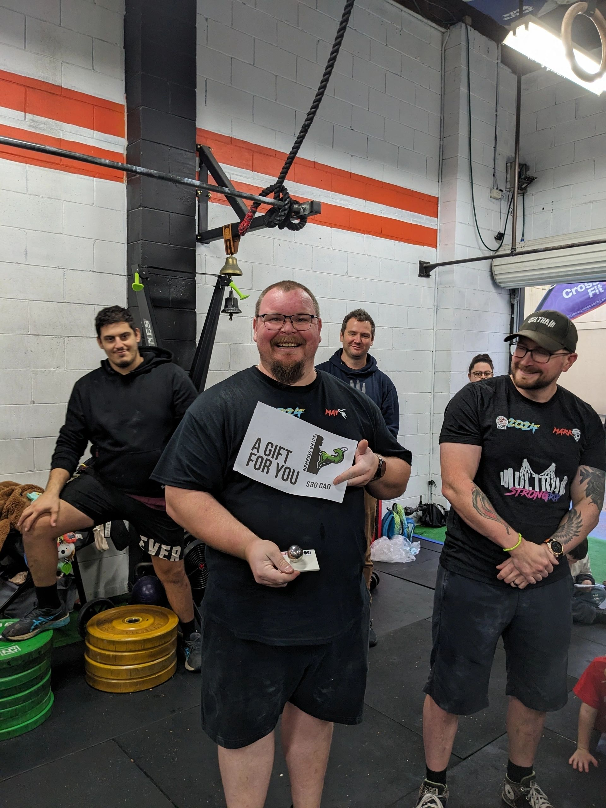
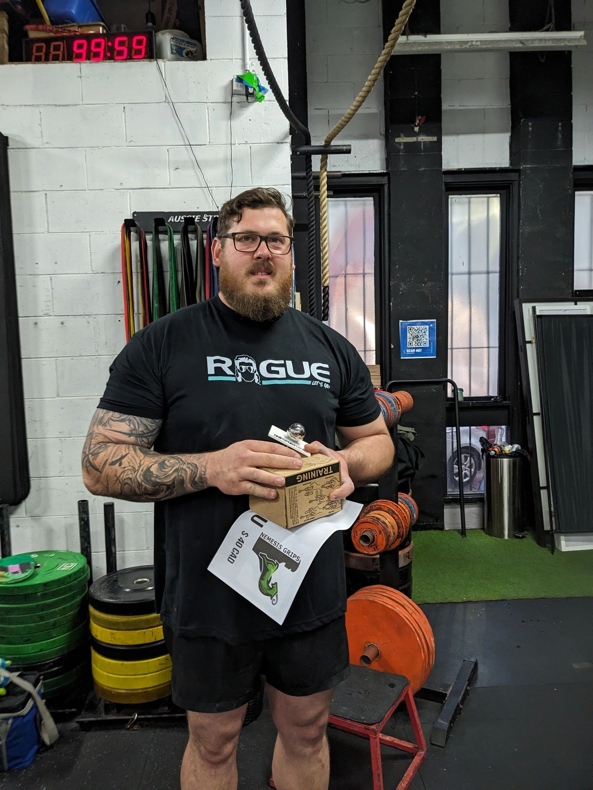

---

Henry Mullett (2nd) Will Fuggle (3rd) and Australian Grip Sport Champion Luke Reynolds

13 competitors on the day with Luke Reynolds winning Overall Champion and  Isaac Pitt taking home the 'Proportional Force Recognition Award' aka Pound for Pound (P4P)

