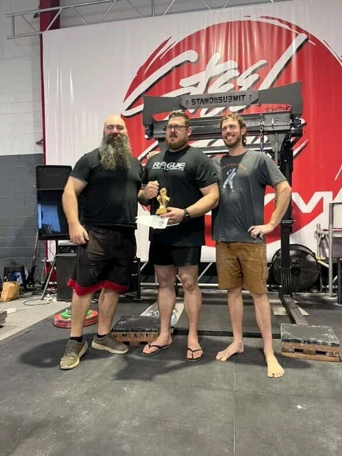
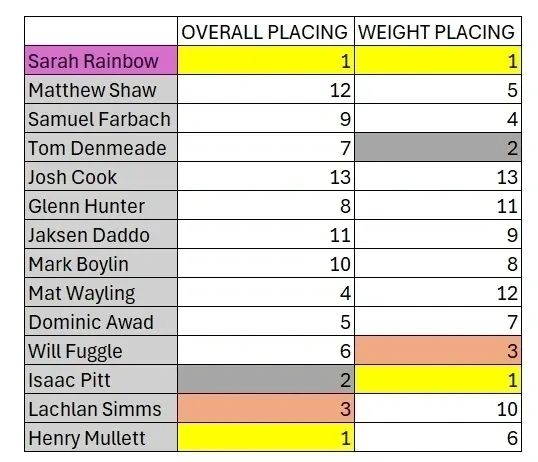
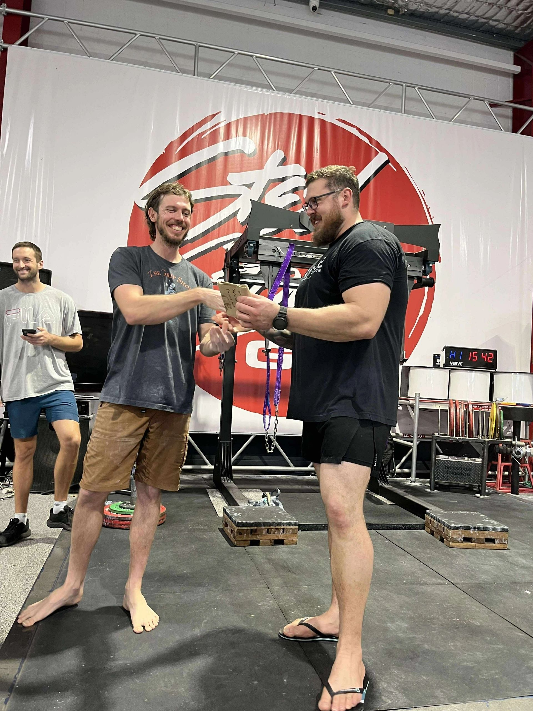
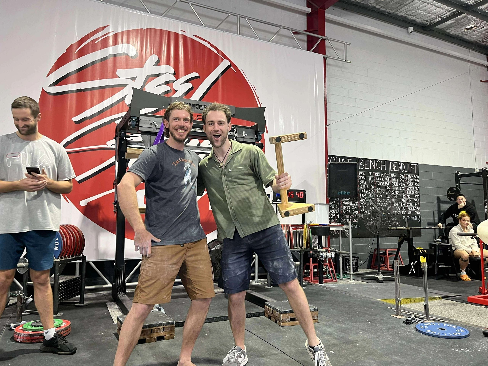
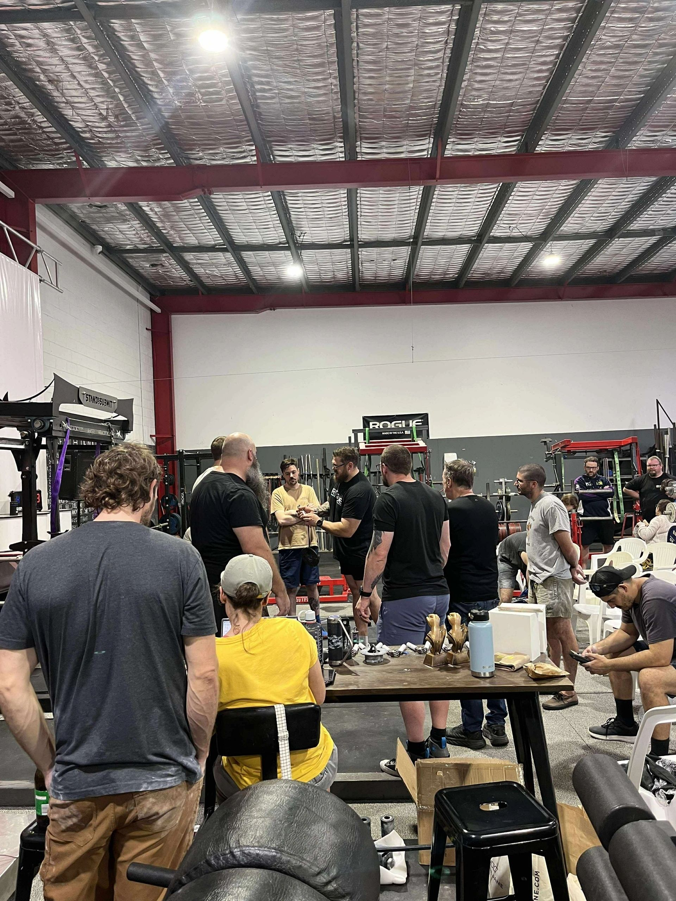
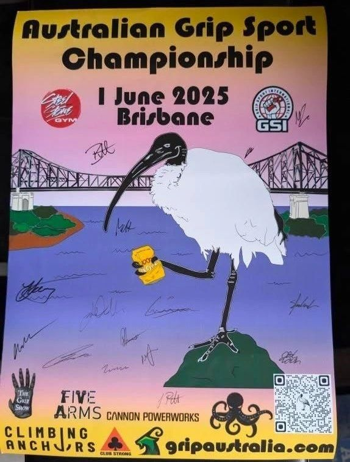
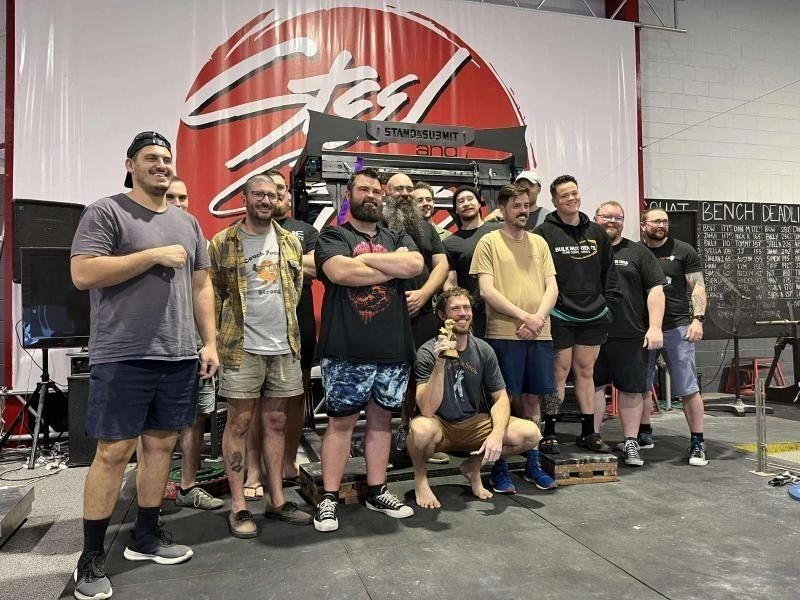

---

Lachlan Simms (3rd) Henry Mullett (1st) and Isaac Pitt (2nd)

14 competitors on the day with Henry Mullett winning Overall Men's Champion, Sarah Rainbow winning Overall Women's Champion and Isaac Pitt taking home the 'Proportional Force Recognition Award' aka Pound for Pound (P4P)

