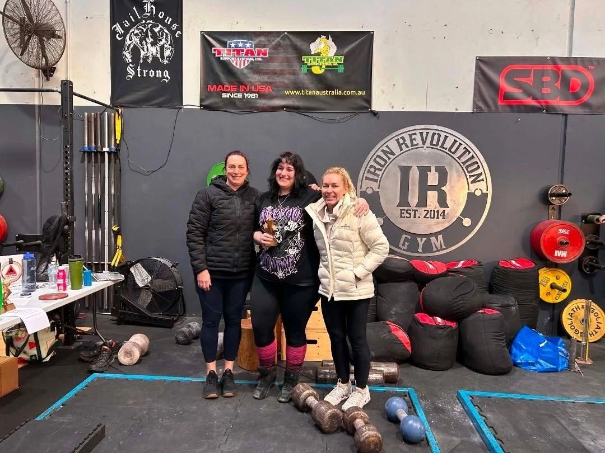
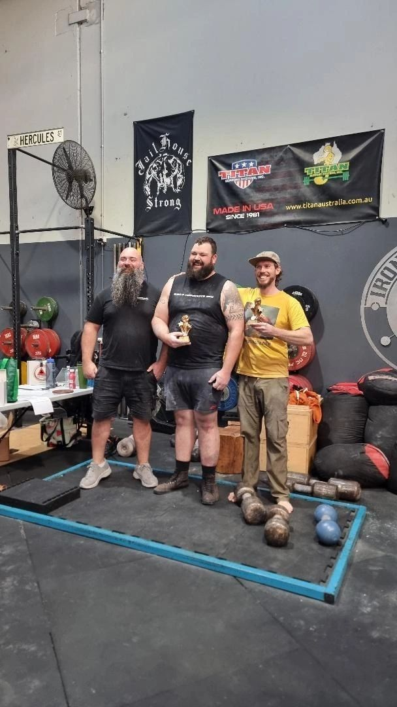
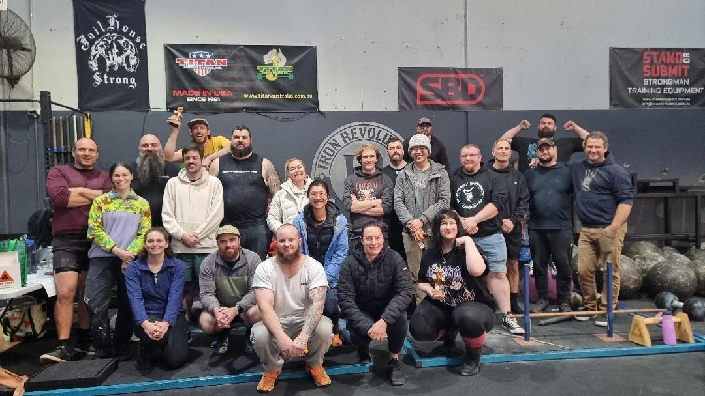
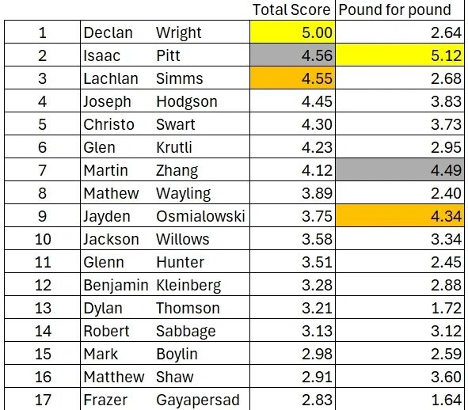
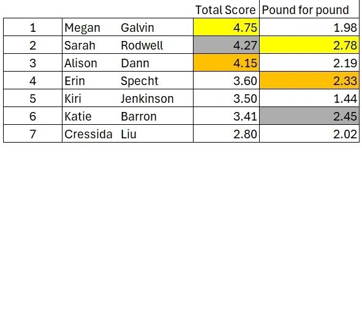
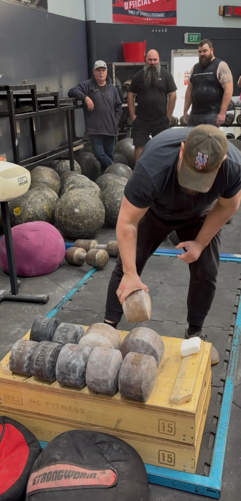
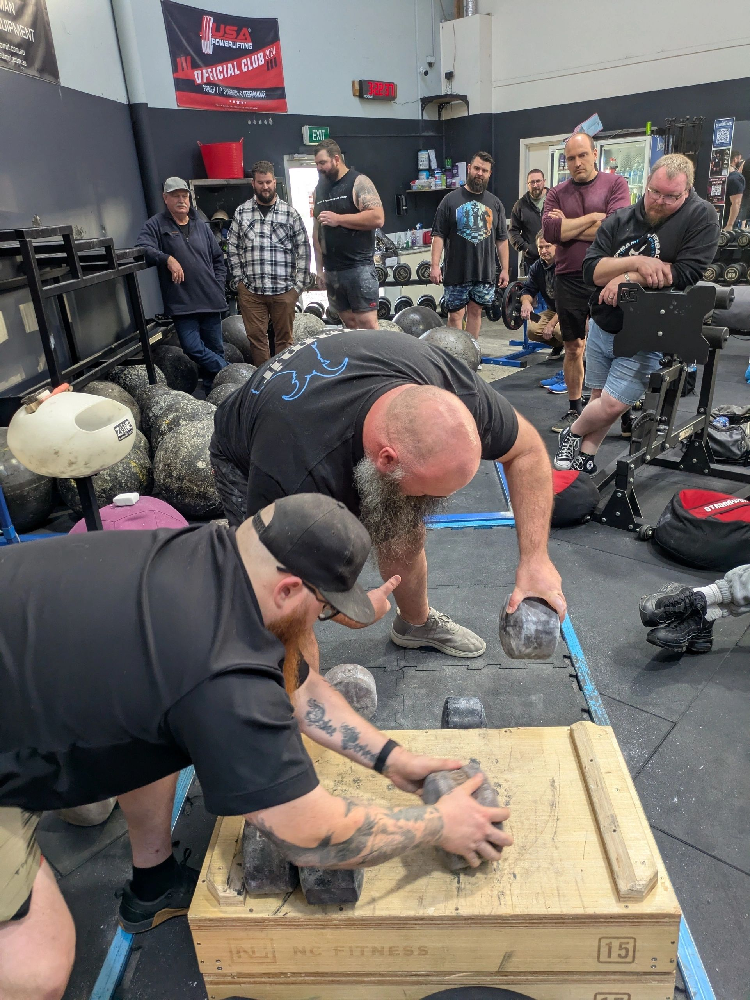
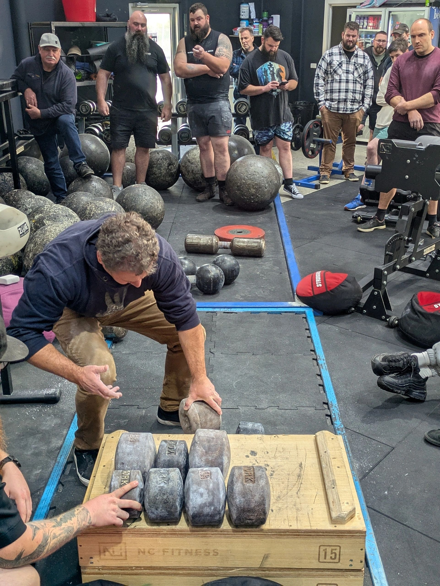

---

#### Women's Podium

Alison Dann (3rd), Megan Galvin (Champion) & Sarah Rodwell (2nd & Pound-for-Pound Champion)

#### Men's Podium

Lachie Simms (3rd), Declan Wright (Champion) & Isaac Pitt (2nd & Pound-for-Pound Champion)

Competitors - 17 Men and 7 Women

## Video

---

#### Inch Run - Isaac Pitt

#### Inch Run - Martin Zhang

#### Inch Run - Megan Galvin

#### Declan Wright - top Vertical Cannon lift 143.3kg
