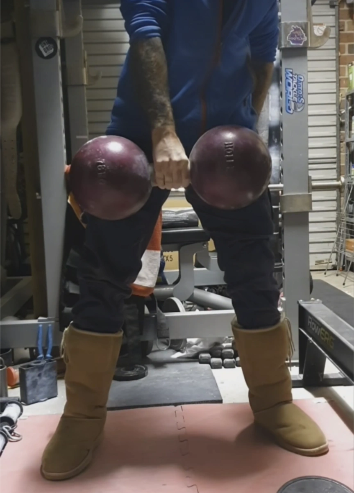

While Grip Sport International governs which implements are recognised in GSI, classic grip feats are an essential part of Grip Sport, with many people training for a feat or certification in preference to competitions.
This page serves as the official Australian honour roll, chronicling the Australian athletes who have performed these feats.

> [!TIP]
> **Looking for National Competition Records?**
> Explore the full, sortable, and filterable [Official Australian Grip Records Registry](/records) for all sanctioned Grip Sport International (GSI) implements.

---

### Quick Jump Navigation

* 📊 [Official Australian Grip Records Registry](/records)
* 🏋️‍♂️ [The Thomas Inch Dumbbell & Heavier Replicas](#the-thomas-inch-dumbbell)
* 🪨 [What is the blob & Heavy Block Weights](#what-is-the-blob)
* 🗜️ [Captains of Crush #3 Certification](#captains-of-crush-grippers)
* ⚡ [IronMind Crushed-to-Dust! Challenge](#crushed-to-dust-challenge)
* 📋 [Submission & Verification Standards](#submitting-a-feat)

---

## The Thomas Inch Dumbbell

The original **Thomas Inch Dumbbell** (famously known as the **"172"** or **"The Inch"**) was cast in the early 1900s by British physical culturist and professional strongman Thomas Inch (1881–1963). Cast as a single solid piece of iron, the dumbbell weighs **78.3 kg (172 lbs 9 oz)** with large spherical globes and a thick, un-knurled handle measuring **60.3 mm (2 3/8 in)** in diameter and 10.1 cm (4 in) in length.

### Why is the Inch Dumbbell So Difficult?

1. **Large Handle requiring Open-Hand Grip:** The 60.3 mm (2 3/8 in) handle generally prevents even large hands from connecting the thumb and fingers, eliminating any passive friction lock.
2. **Extreme Rotational Torque:** Because the heavy spherical bells are cast in one piece with the handle, the bell feels like it will roll out of the lifter's fingers.
3. **Smooth Finish:** Inch dumbbells feature a cast-iron finish without knurling.

### Progression of Heavy Inch Bells

In addition to standard 78 kg replicas heavier Inch replicas have also been created to push the limits of grip and will be tracked on this website.
* **78 kg:** The standard Inch benchmark.
* **83 kg:** Hodgson-Krutli (HK) replica created in Australia.
* **85 kg**: Holle Dumbbell
* **95 kg:** Stand or Submit (SoS) Circus Bell.
* **104 kg:** Holle Dumbbell.

---

### Australian Inch Dumbbell Honour Roll

The following Australian athletes have officially lifted the Thomas Inch Dumbbell replica or heavier Inch replicas to lockout:

| Athlete | Bells Lifted | Video / Documentation |
| :--- | :--- |:--- |
| **Bruce White** | First Thomas Inch Dumbbell Replica| [Bruce White's Inch Dumbbell Story](https://www.oldtimestrongman.com/blog/2015/09/03/bruce-whites-inch-dumbbell/) |
| **Joseph Hodgson** | 78kg Holle, 78kg Sorinex, 83kg HK, 104kg Holle, SoS 95kg Circus Bell | [83kg HK Lift](https://www.instagram.com/reel/CuUPVHmAgrm/) • [SoS 95kg Circus Bell](https://www.instagram.com/reel/CeQJ_U7gXLO/) • [Wallace Challenge Bells](https://www.oldmanofthestones.com/blog/wallace-challenge-dumbells) • [The Grip Show Interview](https://www.youtube.com/watch?v=fOT-4Gl1FrI&t=4819s) |
| **Ben Cossey** | 78kg Holle, 83kg HK | [78kg Holle Lift Video](https://vimeo.com/862290524) • [83kg HK Lift Reel](https://www.instagram.com/reel/CuUPVHmAgrm/) |
| **Luke Reynolds** | 78kg Holle, 83kg HK | [78kg & 83kg HK Lift Reel](https://www.instagram.com/reel/CsFDEgmub9n/) |
| **William Fuggle** | 78kg Holle, 83kg HK | [78kg Holle Lift Video](https://vimeo.com/862274273) • [83kg HK Lift Reel](https://www.instagram.com/reel/CuUPVHmAgrm/) |
| **Isaac Pitt** | 78kg Holle, 83kg HK | [78kg Holle Lift Reel](https://www.instagram.com/reel/CwbeSoqBXQ2/) |
| **Glen Krutli** | 78kg Holle, 83kg HK | Documented lift |
| **Henry Mullett** | 78kg Holle | Documented lift |
| **Tom Denmeade** | 78kg Holle |  Documented lift |
| **Lachlan Simms** | 78kg Holle | Documented lift |
| **Mathew Chessum** | 78kg Holle | Documented lift |
| **Christopher Meredith** | 78kg Holle | Documented lift |

---

## What is the blob

  <iframe src="https://www.youtube.com/embed/Eqri9qfQvWA" title="What is the blob?" allow="accelerometer; autoplay; clipboard-write; encrypted-media; gyroscope; picture-in-picture" allowfullscreen></iframe>

In 1992, legendary strength pioneer Richard Sorin sawed the head off a broken vintage York 45.4 kg (100 lb) round-headed dumbbell, christening the severed half **"The Blob"**. Weighed at approximately **22.7 kg (50 lb)**, it revolutionised block-weight training and became the international gold standard for wide pinch grip strength.

### The Challenge of the Blob

Unlike a flat pinch block, the Blob features steeply sloping, rounded, convex cast-iron faces. To lift it by the slick top and sloping sides requires immense open-hand thumb clamp pressure. There is no lip, ridge, or corner to catch; the weight must be hoisted purely by the frictional opposing pressure of the thumb against the opposing four fingers.

### Blob Variations lifted in Australia

  <iframe src="https://player.vimeo.com/video/862273051?h=06c8ffd409&title=0&byline=0&portrait=0" title="William Fuggle - 24kg Holle Blob Lift" allow="autoplay; fullscreen; picture-in-picture" allowfullscreen></iframe>

---

### Australian 22.7 kg+ (50 lb+) Blob Lifters Honour Roll

The following Australian athletes have successfully lifted a 22.7 kg / 50 lb (or heavier) Blob to lockout:

| Athlete | Blobs Lifted | Implement Details | Proof / Footage |
| :--- | :--- | :--- | :--- |
| **Joseph Hodgson** | 24kg Holle, 30kg Holle, Original Fatman, Legacy 120, Hodgson Blob, Blobzilla | Full progression up to **Blobzilla** (~29.5 kg+ / 65+ lb) | Documented lifts |
| **William Fuggle** | 24kg Holle, Original Fatman | 24 kg Holle replica & original vintage 22.7 kg (50 lb) York Fatman | [24kg Holle Lift](https://player.vimeo.com/video/862273051?h=06c8ffd409) • [Fatman Blob Lift](https://vimeo.com/900485203) |
| **Ben Cossey** | 24kg Holle, Original Fatman | 24 kg Holle replica & vintage 22.7 kg (50 lb) Fatman | Documented lifts |
| **Luke Reynolds** | Original Fatman | Vintage 22.7 kg (50 lb) York roundhead half | [Luke Reynolds Fatman Lift Reel](https://www.instagram.com/reel/CsFDEgmub9n/) |
| **Isaac Pitt** | KWN 50, Original Fatman | 22.7 kg (50 lb) KWN block & vintage 22.7 kg (50 lb) Fatman | [Isaac Pitt KWN 50 Shorts](https://youtube.com/shorts/-2kPt6aV4Bo) |
| **Henry Mullett** | 24kg Holle, 30kg Holle | 24 kg (~53 lb) and heavy 30 kg (~66 lb) Holle replicas | Documented lifts |
| **Glen Krutli** | Hodgson Blob, 24kg Holle | Custom Hodgson Blob & 24 kg Holle replica | Documented lifts |

---

## Captains of Crush Grippers

### Australian Certified CoC #3 Closers

| Year | Athlete | Gripper | Certification Status | Official Verification |
| :--- | :--- | :--- | :--- | :--- |
| **2023** | **Jermiah Merciconah** | Captains of Crush No. 3 | Officially Certified | [Watch Certification Video](https://www.youtube.com/watch?v=Fc5NZ1OROWE) • [IronMind Certification Roster](https://ironmind.com/product-info/certification/captains-of-crush/whos-who-no.-3-coc/) |
| **2008** | **Sam Scott** | Captains of Crush No. 3 | Officially Certified | [IronMind Certification Roster](https://ironmind.com/product-info/certification/captains-of-crush/whos-who-no.-3-coc/) |
| **2003** | **Jeff Tan** | Captains of Crush No. 3 | Officially Certified | [IronMind Certification Roster](https://ironmind.com/product-info/certification/captains-of-crush/whos-who-no.-3-coc/) |
| **2003** | **Justin Byrnes** | Captains of Crush No. 3 | Officially Certified | [IronMind Certification Roster](https://ironmind.com/product-info/certification/captains-of-crush/whos-who-no.-3-coc/) |

---

## Crushed-to-Dust! Challenge

Introduced by IronMind in 2012, the **Crushed-to-Dust! Challenge** tests a lifter's all-around grip competence across three fundamentally different mechanical stress vectors. All three feats must be successfully executed within a strict **3-minute time limit**:

1. **Crushing Grip:** Close a Captains of Crush No. 2 gripper (88.5 kg / ~195 lb).
2. **Revolving Thick Bar:** Deadlift **90 kg (198 lb)** on the IronMind Rolling Thunder handle.
3. **Hub Pinch:** Deadlift **20 kg (44 lb)** on the IronMind Hub by pinching the smooth, circular hub.

---

### Australian Certified Athletes

| Year | Athlete | Status | Milestone | Verification |
| :--- | :--- | :--- | :--- | :--- |
| **2024** | **Will Fuggle** | Certified | **1st Australian to officially certify** | [IronMind Certification Roster](https://www.ironmind.com/certification/crushed-to-dust-challenge/certification-list/) • [Watch Video](https://www.youtube.com/watch?v=G_0bfqXlGfc&t=60s) |
| **2025** | **Isaac Pitt** | Certified | Officially certified | [IronMind Certification Roster](https://www.ironmind.com/certification/crushed-to-dust-challenge/certification-list/) • [Watch Video](https://www.youtube.com/watch?v=8BRUsE_1KkA) |

---

## Submitting a Feat

Have you completed an iconic grip feat or certified on an official implement? Grip Australia maintains this register as a permanent record of Australian strength history.

### Verification Guidelines for Submission

* **Continuous, Unedited Video:** Video must capture the attempt from initial setup to completion without cuts or camera shifts.
* **Implement Inspection:** Show the implement clearly, including manufacturer markings, weight stamps, or scale verification where relevant.
* **Proper Lockout:** Clear full-body lockout with knees locked, hips extended, and shoulders back.
* **Controlled Descent:** The implement must be returned to the floor under control (no dropping).

To submit your verified lift or official certification for inclusion in the Australian Honour Roll:

* 📝 **Submit Online:** Open a [Record / Feat Verification Submission on GitHub](https://github.com/Buhtig3/gripaustralia/issues/new?template=submit-record-feat.yml) with your attempt details and video link.
* 💬 **Direct Message:** Contact Grip Australia via Instagram DM at [@pinch_bypinch](https://instagram.com/pinch_bypinch) or visit our [Get Involved / Contact Page](/get-involved).

