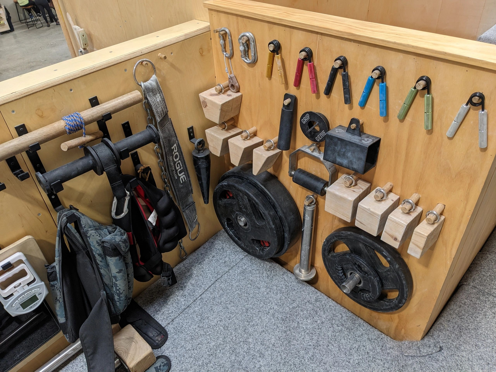

Starting out in grip sport doesn't require an entire gym full of specialized apparatus. With a handful of versatile, standardized implements, you can develop crushing, pinching, and open-hand support strength that transfers directly to official Grip Sport International (GSI) contests.

Here is the definitive guide to the essential tools every beginner should consider.

---

## 1. IronMind IM Tug Grippers

While full-size torsion-spring grippers (like the [Captains of Crush](/gripper-rating-service)) test whole-hand crushing power, **IM TUG (Two-by-Two) Grippers** are specifically engineered to isolate individual finger pairs and the thumb.

### Why IM Tugs are Essential for Beginners:
* **Target Weaker Digits:** In a standard gripper close, the powerful index and middle fingers naturally dominate. IM Tugs force your ring and little finger (the pinky provides up to 30–40% of hand closure force) to work independently.
* **Thumb Clamping Work:** By setting the thumb against one handle and a finger against the other, you can train crushing thumb strength, direct pinch opposition, and joint stability.
* **Tendon Conditioning:** Because they load two fingers at a time, you can dial in tendon recovery and volume without fatiguing your central nervous system (CNS).

---

## 2. Olympic Loading Pins & Carabiners

The **loading pin** is the undisputed backbone of vertical lift grip athletics. Virtually every thick-handled lift, pinch block, and hub device connects to a loading pin via a heavy-duty rated carabiner.

### What to Look For:
* **Shaft Diameter:** Standard loading pins come in **1.9" (48–50 mm)** to securely fit Olympic 2-inch barbell plates without tilting or rocking.
* **Base Plate:** A wide, welded steel base (minimum 75–100 mm diameter) ensures plates remain stable during explosive off-the-floor pulls.
* **Welded Top Eyelet:** Choose a pin with a forged or fully-welded eye bolt capable of handling 200+ kg shock loads.
* **Heavy-Duty Carabiner:** Always use climbing-rated steel or high-tensile alloy carabiners (minimum 12 kN / ~1,200 kg breaking strain). Avoid cheap aluminum hardware store clips.

---

## 3. Magnesium Carbonate Chalk

No single piece of equipment improves your grip performance faster than pure **gymnastic magnesium carbonate ($MgCO_3$)**.

```
Sweat + Smooth Steel = Zero Friction
Dry Chalk + Knurling = Maximum Mechanical Interlock
```

### Best Practices for Grip Sport:
1. **Quality Matters:** Use pure athletic grade magnesium carbonate blocks. Avoid liquid chalk containing sticky resins or colophony unless permitted by the specific contest rules.
2. **Light, Even Dusting:** More chalk is not always better. Caking excessive chalk into the knurling fills the grooves, effectively smoothing out the surface and reducing bite.
3. **Keep Knurling Clean:** Use a stiff nylon or brass-bristled brush between heavy attempts to clear compacted chalk and skin debris out of handle knurling.

---

## 4. Pinch Block Weights & Half-Dumbbells

Pinch strength is the ultimate test of thumb power. Unlike crushing with your fingers wrapped around a handle, pinching relies entirely on the opposing clamping power of the thumb against the fingers.

### Core Training Implements:
* **Rectangular Pinch Blocks (2" and 3"):** Flat-faced steel, aluminum, or hardwood blocks that attach directly to a loading pin. Contests like the Australian Nationals frequently feature events like the *Napalm's Nightmare 2-Hand Pinch (3" Blocks)*.
* **Block Weights (Hex Half-Cuts):** The classic DIY grip builder. Sawing the head off a cast-iron hex dumbbell creates an awkward, tapered block weight that forces intense thumb clamping.
* **The York Blob:** Conquering a half 100 lb York dumbbell (50 lbs) is one of the most legendary [Australian Grip Feats](/australian-grip-feats).

---

## 5. Summary: Your Starter Kit Checklist

| Equipment | Primary Focus | Best Starting Specification |
| :--- | :--- | :--- |
| **Captains of Crush** | Whole-hand crushing | Trainer (~58 lb RGC) or #1 (~81 lb RGC) |
| **IM Tug Gripper** | Digit isolation & pinky drive | Tug 1 or Tug 2 |
| **Loading Pin** | Support & vertical lifting | 12" length, 1.9" Olympic diameter |
| **Pinch Block** | Thumb clamping strength | 2-Hand 3" Block or 1-Hand 2" Block |
| **Chalk & Brush** | Friction & safety | Magnesium carbonate block + nylon brush |

---

> [!TIP]
> **Need Your Grippers Accurately Rated?**
> Check out the [Artie's Grip Gym Rating Service](/gripper-rating-service) to get your torsion-spring grippers calibrated against Cannon PowerWorks standards with durable color-coded tags right here in Australia.
