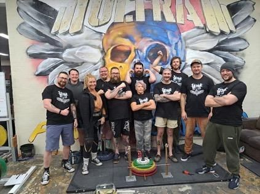

Whether you're looking to close your first heavy gripper, train with seasoned lifters, or step onto the platform at your first contest, we are working on creating a launchpad to get you involved in Australian grip sport.

---

### Pathway 1: Connect with the Community

Australian grip sport thrives on shared knowledge, home-gym sessions, and peer encouragement.

* **Follow & Tag on Instagram:** Connect directly with [@pinch_bypinch](https://instagram.com/pinch_bypinch). Tag `#AustralianGripSport` and `#GripAustralia` on your training clips to get featured and link up with lifters in your area.
* **Global Discussion & Archives:** Join [The GripBoard](https://www.gripboard.com/)—the world's premier forum for grip history, contest announcements, training logs, and equipment reviews.
* **Reddit Community:** Explore [r/GripTraining](https://www.reddit.com/r/GripTraining) for beginner routines, technique checks, and equipment advice.

---

### Pathway 2: Gear Up & Find a Place to Train

You don't need a warehouse full of specialized steel to start building world-class hand and forearm power.

* **Essential Starter Gear:** Read our [Beginner's Equipment Guide](/equipment-guide) for breakdowns of loading pins, rotating handles, pinch blocks, and chalk selection.
* **Calibrate Your Grippers:** Get your grippers rated locally to Cannon PowerWorks standards via [Artie's Grip Gym Rating Service](/gripper-rating-service).
* **Equipment Suppliers:** Check out dedicated Australian distributors like [FiveArms](https://fivearms.com.au) and [Club Strong](https://clubstrong.com.au).

---

### Pathway 3: Step onto the Competition Platform

Competitions welcome lifters of every experience level—from total novices testing their baseline to national record holders.

* **Browse Upcoming Competitions:** Check the [Competition Calendar](/competition-calendar) for GSI-sanctioned events.
* **Beginner Friendly:** All competitions welcome beginners except the Australian Grip Sport Championship which may have qualifying conditions. Rules are explained during the athlete briefing, and the grip community is renowned for cheering on first-time lifters.
* **Host a Sanctioned Event:** Want to bring grip sport to your local gym or club? Contact us to sanction and list your competition on the Grip Australia calendar.
