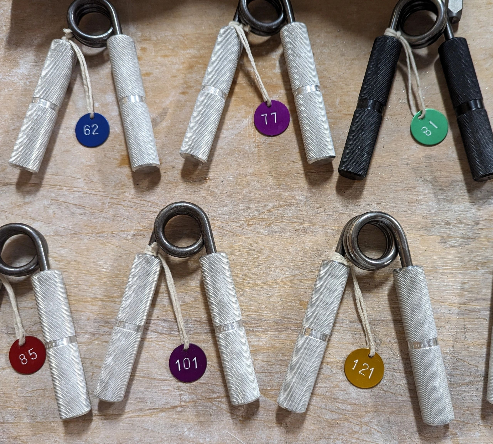

### Artie's Grip Gym: Australian Gripper Rating Service

If you're serious about hand strength and crushing power, you've almost certainly heard of **RGC (Rating Gripper Calibration)** ratings for torsion-spring grippers.

[Cannon PowerWorks](https://cannonpowerworks.com/) in the USA pioneered standardized gripper calibration. However, the cost of return international shipping, customs declarations, and US dollar conversion can make sending grippers overseas prohibitively expensive for Australians ($80–$120+ AUD round-trip).

Artie's Grip Gym provides Australian grip athletes with calibrated RGC ratings directly matched to Cannon PowerWorks standards.

#### Pricing & Services

* **1st Gripper:** $10 AUD
* **Each Additional Gripper:** $5 AUD (in the same shipment)
* **Return Shipping:** Sender to include a self-addressed, prepaid Australia Post tracked satchel.
* **Turnaround:** Typically 2–4 business days within Australia.
* **Rating Tag:** Each calibrated gripper is returned with an anodized aluminum disc tag stamped with its verified RGC value.
