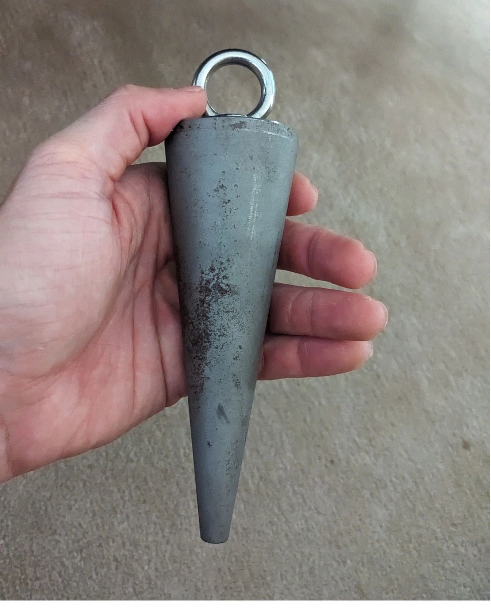

### Official Mullett's Mandrel Leaderboards

#### Men's Mandrel Rankings

| Rank | Name | Best Lift (kg) | Best Lift (lbs) | Status |
| :---: | :--- | :---: | :---: | :--- |
| 🥇 1 | **Henry Mullett** | **133.55 kg** | **294.4 lbs** | 🏆 **Current Australian Record** |
| 🥈 2 | **Isaac Pitt** | 113.55 kg | 250.3 lbs | Official Lift |
| 🥉 3 | **Glenn Hunter** | 93.55 kg | 206.2 lbs | Official Lift |
| 4 | **Thomas Denmeade** | 93.55 kg | 206.2 lbs | Official Lift |
| 5 | **Joseph Hodgson** | 91.30 kg | 201.3 lbs | Official Lift |
| 6 | **Jayden Osmialowski** | 88.55 kg | 195.2 lbs | Official Lift |
| 7 | **Samuel Vogt** | 88.55 kg | 195.2 lbs | Official Lift |
| 8 | **Mark Boylin** | 79.50 kg | 175.3 lbs | Official Lift |
| 9 | **Travis Herbert** | 78.55 kg | 173.2 lbs | Official Lift |
| 10 | **Dominic Awad** | 73.80 kg | 162.7 lbs | Official Lift |
| 11 | **Lachlan Simms** | 73.80 kg | 162.7 lbs | Official Lift |
| 12 | **Mathew Wayling** | 73.80 kg | 162.7 lbs | Official Lift |
| 13 | **James Sue** | 68.80 kg | 151.7 lbs | Official Lift |
| 14 | **Dean "Dead" Redzic** | 68.55 kg | 151.1 lbs | Official Lift |
| 15 | **Sean Magnusson** | 63.55 kg | 140.1 lbs | Official Lift |
| 16 | **Thomas Claxton** | 63.80 kg | 140.7 lbs | Official Lift |
| 17 | **Joseph Ameer** | 58.80 kg | 129.6 lbs | Official Lift |
| 18 | **Andrew Hodge** | 38.55 kg | 85.0 lbs | Official Lift |
| 19 | **James Burns** | 38.55 kg | 85.0 lbs | Official Lift |

#### Women's Mandrel Rankings

| Rank | Name | Best Lift (kg) | Best Lift (lbs) | Status |
| :---: | :--- | :---: | :---: | :--- |
| 🥇 1 | **Sarah Rodwell** | **53.80 kg** | **118.6 lbs** | 🏆 **Current Australian Record** |
| 🥈 2 | **Megan Galvin** | 53.55 kg | 118.1 lbs | Official Lift |
| 🥉 3 | **Naomi Denmeade** | 48.55 kg | 107.0 lbs | Official Lift |

---

#### About Mullett's Mandrel

The Mullett's Mandrel is an Australian made grip tool by Henry Mullett, fashioned after the mandrel - a tapered tool used by blacksmiths to forge, press, stretch or shape an object.

Henry Mullett's current 133.55kg record 

  <iframe src="https://player.vimeo.com/video/1113586899?title=0&byline=0&portrait=0" title="Henry Mullett's current 133.55kg record" allow="autoplay; fullscreen; picture-in-picture" allowfullscreen></iframe>

