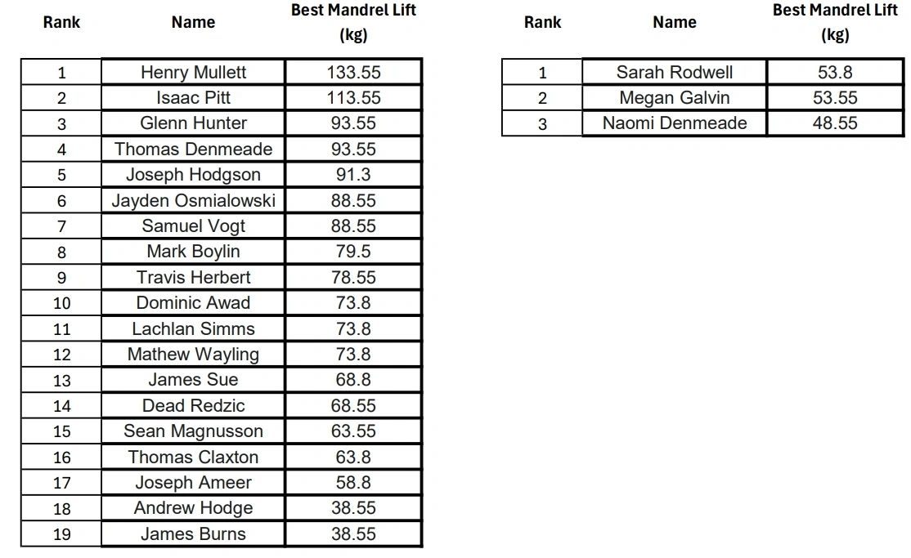

---

#### Mullett's Mandrel

The Mullett's Mandrel is an Australian made grip tool by Henry Mullett, fashioned after the mandrel - a tapered tool used by blacksmiths to forge, press, stretch or shape an object.

Henry Mullett's current 133.55kg record 

  <iframe src="https://player.vimeo.com/video/1113586899?title=0&byline=0&portrait=0" title="Henry Mullett's current 133.55kg record" allow="autoplay; fullscreen; picture-in-picture" allowfullscreen></iframe>

