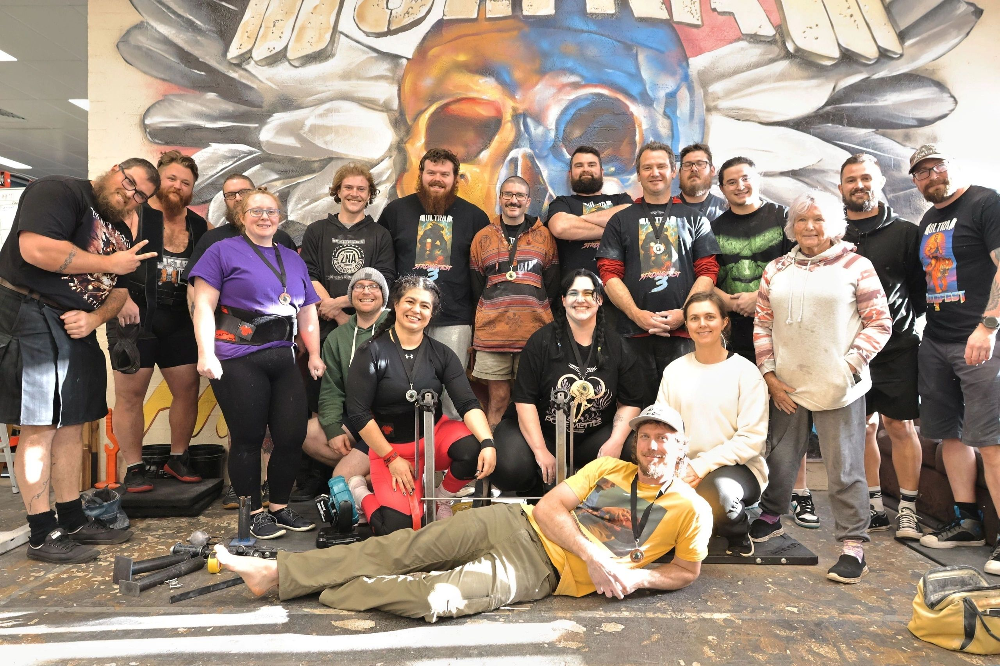

**Grip Sport** is a sport which tests competitors’ grip strength, or more widely, hand, wrist, and forearm strength. While people often equate grip simply with squeezing or holding a standard barbell, competitive grip sport tests strength along distinct biomechanical dimensions.

Originating from 19th and early 20th-century strongman displays of strength such as heavy globe dumbbell lifts, anvil horn lifts, and weight plate pinching, modern grip sport has grown to include specifically made competition imlpements to test various grip strength and is a sport governed by international standards.

---
## How Competitions Work

Official grip contests in Australia and internationally operate under the governance of **Grip Sport International (GSI)**. 

### Contest Formats
Competitions typically feature 3 to 5 events covering multiple disciplines, run in one of two formats:
1. **Rising Bar Format:** The weight on the implement increases progressively. Athletes select the weight at which they enter and may take attempts as weight increases. Once the athlete can no longer lift the weight or they choose to end their lifts the most recent successful lift is counted. Once a weight has been skipped or failed it is not possible to attempt a lighter weight.
2. **Standard Round Format:** Similar to Olympic weightlifting or powerlifting, each competitor receives 3 or 4 attempts per event, with the highest successful lift counting toward their score.

### Rules & Crossbar/Lockout
More info coming soon
---

## Why Train Grip Strength?

Specialized grip training delivers carryover across athletic performance and long-term musculoskeletal wellness:

* **Eliminate Deadlift & Pulling Weaknesses:** Powerlifters and strongmen regularly discover their prime movers (back and legs) outpace their grip. Thick bar and support training ensures your hands never forfeit a personal record.
* **Combat Sports & Grappling:** In Brazilian Jiu-Jitsu, Judo, and wrestling, grip dominance dictates control. Powerful finger and thumb clamping exhausts opponents and breaks collar and sleeve grips effortlessly.
* **Rock Climbing & Bouldering:** Open-hand support and pinch training builds resilience on slopers, pinches, and crimp holds.
* **Joint Longevity:** Balanced hand training may also relieve repetitive strain from desk work.

---

## Essential Beginner Gear

You don't need an entire warehouse of expensive apparatus to start building formidable grip power.

> [!NOTE]
> ### 📖 Explore the Beginner's Equipment Guide
> Looking for exact specifications, brand recommendations, and setup advice? Check out our dedicated guide:
> 
> **👉 [Read the Beginner's Equipment Guide](/equipment-guide)**: Coming Soon

### The Starter Checklist
Coming Soon

---

## How to Get Involved in Australia

Whether you want to test yourself against the national records or just train with like-minded lifters, the Australian grip community welcomes athletes of all backgrounds:

* **Browse Upcoming Competitions:** Visit the [Competition Calendar](/competition-calendar) to find upcoming sanctioned GSI contests s.
* **Checkout the Champs:** View past scorecards, photos, and champion honours at the [National Championships Hub](/championships) and the recent [2026 Championship Archive](/2026-championship).
* **Check the Record Books:** See the current benchmarks across all bodyweight classes on the [Australian Grip Records](/records) page.
* **Connect with the Community:** F [Get Involved](/get-involved).

---

  Special recognition to <a href="https://www.canadagripsport.com/" target="_blank" rel="noopener" class="underline hover:text-[var(--text-main)]">Eric Roussin</a> (Canada Grip Sport) and <a href="http://www.gripsport.org/" target="_blank" rel="noopener" class="underline hover:text-[var(--text-main)]">Grip Sport International (GSI)</a> for foundational rules curation, historical documentation, and global record administration.

